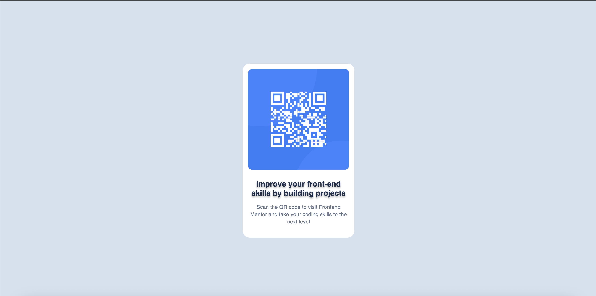

# Frontend Mentor - QR code component

A simple solution for the [Frontend Mentor](https://www.frontendmentor.io) challenge -QR Code Component.

This project was created to practive HTML & CSS following the disign in Figma.

---

## Overview
This project recreates a **QR Code card component** from a Figma design, including:  
- Centered card layout  
- QR code image  
- Title and description text  
- Mobile-first responsive design  
- Smooth scaling for larger screens (desktop)

---

## Links
- Solution URL: [GitHub Repository](https://github.com/przemekkoczwara/qr-code-component)  
- Live Site URL: [Your Live Site](https://przemekkoczwara.github.io/qr-code-component/)  

---

## Built With
- HTML5 & Semantic Markup  
- CSS Variables & Flexbox  
- Mobile-first responsive design  

---

## What I Learned
- How to implement a **mobile-first responsive component**.  
- Using **CSS variables** for colors, typography, and spacing for maintainable design.  
- Centering a card both vertically and horizontally using **flexbox**.  

